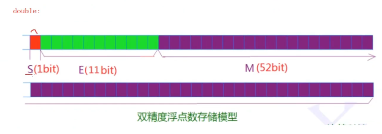

# 1数据的分类
>整型家族
1. char int long，以及对应的signed unsigned
>浮点型
1. float long
>构造类型
1. int arr[10],类型是int [10]；int arr[5]，类型时int [5];
2. 结构体struct
3. enum
4. union
>指针
>void类型

# 2整型在内存中的存储（定义在limits.h中）
~~~
int main()
{
    int a =-10;

    return 0;
}
~~~
数据在内存中以二进制表示有3中表示：原码（我们看到的），反码，补码（内存存储的）。正整数的3码相同；负整数存的时补码，看的是原码，~源码（原码符号位不变）+1=补码。

为什么是补码呢？因为CPU只有加法器，ALU，没有减法器，所以像类似运算1-1时，1+（-1），如果是原码则为：00000000 00000000 00000000 00000001+10000000 00000000 00000000 00000001 = -2；
如果是补码：00000000 00000000 00000000 00000001+11111111 11111111 11111111 11111111 = 1 00000000 00000000 00000000 00000000(多了一位，去掉最高位) =  00000000 00000000 00000000 00000000 = 0。此外，原码到补码，补码到原码过程是完全一样的，都可以先取~，然后+1，不需要额外的硬件去模拟-1。

编译器在安排内存的存储时，将数据倒着存（小端字节序）。比如，int a = 0x11223344，大端字节序为11223344，把数据的低位字节序的内容放在高地址处，高位字节序内容放低地址处；小端字节序为44332211。
>面试题：请阐述大端字节序，小端字节序的概念，并设计一个小程序判断当前机器的字节序。

```
#include <iostream>
using namespace std;

int main()
{
    int a = 1;
    //不能直接char *pa = &a;因为类型本身就是不一样的
    char *pa = (char *)&a;
    //不要直接cout<<*pa;
    if (*pa == 1)
    {
        cout << "s" << endl;
    }
    else
    {
        cout << "l" << endl;
    }
    system("pause");
    return 0;
}
```
>输出什么？
```
#include<stdio.h>
int main()
{
    //-1:10000000 00000000 00000000 00000001->11111111 11111111 11111111 11111111（补码）;截断 a = 1111111;
    //同理b = 1111111;(补码)
    //同理c = 1111111；
    //但是在以(int)类型输出时（发生整型提升）：
    //a和b因为是有符号的，所以a,b变成
    //11111111 11111111 11111111 11111111(补码)对应的原码就是-1

    //对于c来说，它同样发生整型提升，但是他是无符号的，是一个“正数”，所以只能用0，而不是1来补充
    //00000000 00000000 00000000 11111111；正数三码合一=255；

    char a= -1;
    signed char b =-1;
    unsigned char c =-1;
    printf("a=%d,b=%d,c=%d",a,b,c);
    return 0;
}
//ps:char在大部分编译器下是signed char,int 则全是signed int
```
>输出什么？
```
int main()
{
    //-128 = 10000000 00000000 00000000 10000000
    //11111111 11111111 11111111 01111111
    //11111111 11111111 11111111 10000000;
    //a = 10000000;
    //cout<<处，整型提升，提升的本身的类型，而不是要输出的类型，所以不是像下面补0，而是依据10000000是有符号的char，补1，为：11111111111111111111111110000000
    //00000000 00000000 00000000 10000000 = 128
    char a = -128;
    cout<<(unsigned int)a<<endl;

    //a=10000000
    //1（被视为符号）1111111 11111111 11111111 10000000 补码
    //10000000 00000000 00000000 01111111+1=
    //10000000 00000000 00000000 10000000
 
    cout<<(int) a<<endl;
    return 0;
}
```
 
>输出什么
```
int main()
{
    //128 = 00000000 00000000 00000000 10000000=三码合一
    //a = 10000000
    
    char a =128;
    //整型提升
    //11111111 11111111 11111111 10000000；（补码），因为UI，所以三码合一，输出该码
    cout<<(unsigned int)a<<end；
}
```

>关于 char a = 127; 127已经是能取的最大值了，取128然后以(int)输出得到的是-128。按0000 0000从大到小排序，char下的排序是 0-127然后是-128到-1。实际上就是因为单字节只能有这些：2^8-1~（-2^8），一旦放超过这个范围的数，那么打印这个数字将会很奇怪（可以按上面方法求出）

>输出什么
```
int main()
{
    //-20 = 10000000 00000000 00000000 00010100
    //补码 = 11111111111111111111111111101011+1 = 11111111111111111111111111101100 = i

    //10 = 00000000 00000000 00000000 00001010
    //*补码！！！！二码合一！！！原码够了!!!*
    //11111111111111111111111111110101+1=11111111111111111111111111110110

    //(int)i+j = 11111111 11111111 11111111 11110110
                 10000000 00000000 00000000 00001010  
    int i =-20;
    unsigned int j=10;
    cout<<(int) (i + j);
}
```
>输出什么？
```
int main()
{
    int i = -20;
    unsigned j = 10;

    //这里隐式强制转换使得i也变成unsigned，那么-20的补码在unsigned中（此时就是原码）就有可能变得很大
    cout<<i+j;

    return 0;
}
```

>编写一个程序，它能够获得一个数的原码

>输出什么？
```
int main()
{
    unsigned int i;
    //9 = 000000000000000000000000000001001，三码合一
    //unsiged int永远大于等于0的，所以当i>=0时，这个条件时恒成立的，所以直接死循环
    for(i = 9;i>=0;i--)
    {
        cout<<(unsigned int)i<<end;
    }
}
```

>输出什么？
```
int main()
{
    char a[1000];
    int i;
    //下列a[i]确实能够被填满但是：
    for(i=0;i<1000;i++)
    {
        a[i] = -1 -i;
    }
    //-1 -2 -3...-127 -128->127...0; 
    cout<<strlen(a)<<endl;//因为是要找到\0,所以上式中等到取0时，strlen就输出这个长度
    return 0;
}
```
>输出什么？
```
#include<stdio.h>

unsigned char i = 0;

int main()
{
    //unsigned char [0,255],则无论你i++怎么+，他一直会在那个un char范围内循环小于255的数，所以直接死循环 
    for(i=0;i<=255;i++)
    {
        cout<<"hello world"<<endl;
    }
    return 0
}
```

# 3浮点型在内存的存储（范围定义在float.h中）
 
 ## 放入
 浮点型和整数在内存中存储的方式是有区别的，整数家族是以补码形式储存，以原码形式输出；而对于浮点型的存储方式，则以国际标准IEEE（电子和电子工程协会）754，任意一个2进制浮点数V可以表示成下面的形式：

- (-1)^s\*M\*2^E
- (-1)^s表示符号位，当s=0，V为正；s=1，V为负。
- M为有效数字，[1,2)
- 2^E表示指数位
- 即只需要存储s,M,E三个数

如5.5，则二进制下为101.1（对于小数位，0.5=2^-1）-->（-1）^0\*1.011\*2^2。此处s=0，M=1.011，E=2；在32bit下，

double 则是如下存储：


此外，IEEE 754对有效数字M和指数E，还有一些规定。由于M总是以1.xxxx，1开头，所以只存储xxxx部分，所以实际上M处可以保存24为有效数字（float）；至于E的存储规则则过于复杂，8bit要+中间值127，11bit+中间值1023。

依据这种规则：

float f = 5.5f->101.1->1.011*2^2;

则 s=0,M=011,E=2+127=129;

则内存中的存储为：0100 0000 1000 0000 0000 0000 0000 0011对应的16进制储存 40 b0 00 00，因为是小端字节序，所以实际上看到的是00 00 b0 40。

## 取出
- 一般情况下，先在E处对应减去127或1023，然后在M处补上1.。
- 当E=0000 0000时，真实的E就是非常接近0，此时E=1-127或1-1023，M不再加1，直接还原成0.xxxx
- E=1111 1111时，对于float，真实E = 1111 1111 -127 = 128，此时这将是一个绝对值及其大的数字 


 ```
int main()
{
    int n=9;
    //0 00000000 00000000000000000001001，二码一致
    //在float的视角上，s=0,E=0000 0000->E_r = -127， M = 0.00000000000000000001001，
    //则该数为0*M*2^(1-127) = 究极接近0，打印精度不够所以直接变0.0000000
    float* pFloat = (float*)&n;
    
    cout<<(int)n<<endl;
    //以浮点数取出里面的数，两者不一致，说明取数方式不一样
    cout<<(float)*pFloat<<endl;

    //以浮点数存入，两者不一致，两者存储方式不一样
    *pFloat = 9.0;
    //1001.0 = 1.001*2^3；此时，s=0,E=3+127=1000 0010,M=001
    //0 1000 0010 00000000000000000000001 = *pFloat
    //int 01000001000000000000000000000001，正数，二码合一 = 1090519041
    cout<<(int)n<<endl;
    cout<<(float)*pFloat<<endl;
}
 ```
