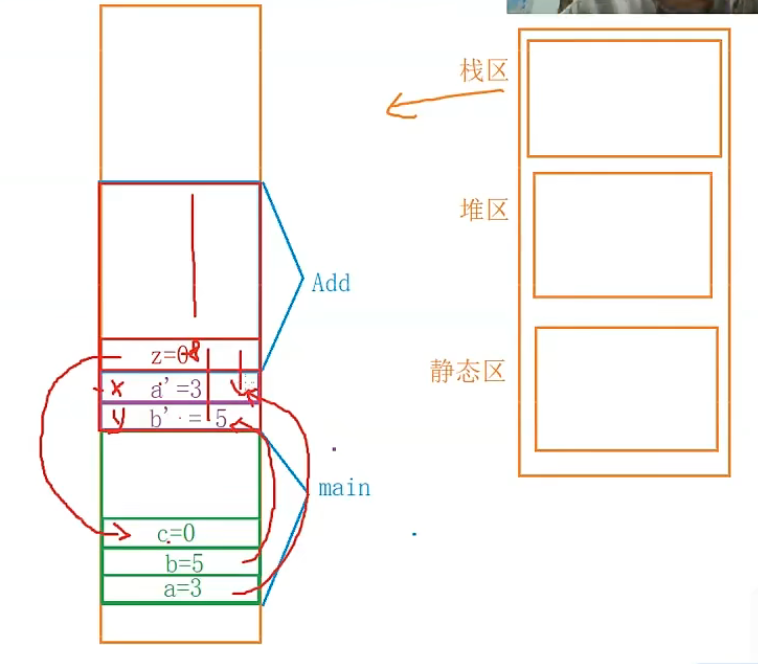
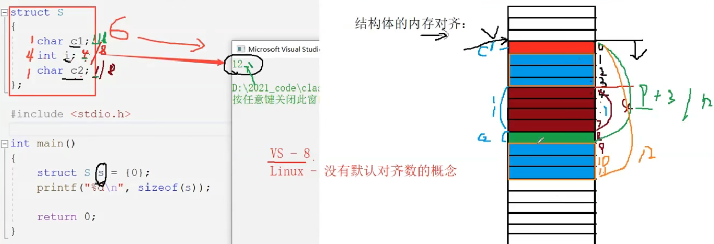

# struct
>结构体是一些值的集合，这些值是成员变量
```
struct Aa
{
    int c;
};
struct Stu
{
    struct Aa a;
    char name[50];
    int age;
}s1{{12},"name",12},s2;
//这里两个也是结构体的变量，但是这里是全局的;我更愿意把这里s1,s2看作对象
```
>选哪个呢？
```
int main()
{
    //假设这里有两个函数，
    Stu a;
    //尽力用第二种形式，因为第一种需要要将实参传到形参，这时候为了接收这个数据，要先开辟一片形参数据空间，这里就是拷贝；
    //而后者不需要开辟一片形参数据空间，但这也因此会使得后面一种的数可以被直接改变，这是另一说。如果不想让他具备改变的能力，加const
    print1(a);
    print2(&a);
    return 0;
}
```
>函数的压栈，每一个函数的调用，都会在内存的栈区上开辟一块空间。
```
int Add(int x, int y)
{
    int z= 0;
    z = x+y;
    return z;

}
//main函数的调用，会在内存的栈区上开辟一片空间，然后放a=3;b=5;c=0;到了c=Add那里时，先为形参又开辟一片空间（从右到左，先开辟形参y，后x（形参push stack），然后开辟Add的一片空间，在Add内部完成了任务后，Add开辟的空间与形参开辟的空间一同pop
int main()
{
    int a =3;
    int b =5;
    int c= 0;
    c = Add(a,b);
}
```


# 结构体的自引用
```
//链表结构
struct Node
{
    int data;
    //struct Node n;//这种套娃是不允许的
    struct Node* next;//指向下一个Node的地址
};

typedef struct Node1
{
    int data;
    struct Node1* next;
}SJDKLJA;
```

# 结构体的内存空间
```
struct S
{
    int i;
    char c;
};

int main()
{
    struct S s ={0};
    cout<<sizeof(s);//输出8，不是5
    return 0;
}
```
>这要考虑结构体内存对齐的问题。对齐规则如下：
1. 第一个成员（如上面的i）在与结构体变量偏移量(offset)为0（类似下标）的地址处存放
2. 其他成员变量（如上面的c）对齐到某个数字（对齐数）的整数倍的地址处(偏移量)
   1. 对齐数=编译器默认的对齐数与该成员大小的较小值。（VS默认是8，linux则没有这个概念）
3. 结构体总大小为最大对齐数的整数倍
4. 如果嵌套了结构体，嵌套的结构体对齐到自己的最大对齐数的整数倍处，结构体的整体大小就是所有最大对齐数（含嵌套结构体的对齐数）的整数倍。
5. (todo)似乎可以用数学推出如何才能最省空间

>为什么要有内存对齐？
有些硬件可能就只支持4个字节4个字节的读取；此外，为了提高读取速度，不重复读取相同内存单元；总的来说就是空间换时间。因此在设计结构体时，1要满足对齐，2要争取时间就被设计上上面的规则。*而在使用时，应该尽量把小的字节的类型放在一起*
>修改默认对齐数
这玩意儿可以修改，VS下用#pragma pack(8)，当设为1时，对齐数的意义就没意义了，一般考虑的是2的n次方。

>//todo 面试题：写一个宏，计算结构体中某变量相对于首地址的偏移，并给出说明。（实际是实现offsetof这个宏）

# 位段
位段的声明与结构是类似的，有两个不同：
1. 位段的成员必须是int, unsigned int 或者 signed int，或者char（整型家族）；
2. 位段的成员名后面有一个冒号和一个数字。
3. 他按照需求以4字节或1字节开辟内存空间
4. 他设计很多不确定因素（比如从哪个方向使用内存位置,VS是先使用低地址然后高地址），且位段不跨平台，不具可移植性，如果考虑移植性，别用！
   1. 如int是有符号还是无符号
   2. x86,x64下的int（2B，4B）是不一样的
   3. 是从高到低还是低到高
   4. 字节内部剩余空间如何利用没有同一
5. 他对于内存空间的使用，在字节与字节间是考虑大小端字节序的，但是其内部是如何使用的，则在不同编译器下是不同的
```
struct A
{
    int _a:1;//意思_a，占1个bits
    int _b:2;//2个bits
    //这东西实际上是让我们管理数据的大小，所以int _c<=32;
};

int main()
{
    A a;
    //当创建这个位段对象时，直接开辟4B的空间，然后根据里面的内容逐个分配（_a分配一个，_b分配一个）当分配完了，或不够时又开辟4B的空间
    a._a = 0;这里是赋值（截断），让0放在只占1个bits的内存中。
    cout<<sizeof(a)<<endl;
    return 0;
}
```
这个概念的意义就是为了让我们更好的管理数据所占的内存空间。

# 枚举，enum，它就是一种类型
>为什么用枚举
1. 能用enum尽力用enum，而不是用#define
2. 提高可读性与维护性
3. 相比#define它并不检查类型，而enum是检查类型的，乱赋值是不允许的
4. #define在调试中是看不到的，因为他会在编译阶段的预编译处#define RED 5   int a = RED;转化为int a =5;枚举就是一直是 int a = RED
5. 定义方便

# union 联合体
```
union Un
{
    char c;
    int i;
};

int main()
{
    union Un u={10};//只允许初始化一个
    u.c = 100；
    u.i = 1000;//此时会把c的值也给改了
    cout<<sizeof(u)<<endl;
    cout<<&u<<endl;
    cout<<&(u.c)<<endl;
    cout<<&(u.i)<<endl;
    //三者一样，他们公用同一个地址与空间，他的大小至少是最大成员的大小
    return 0;
}
```
>请设计程序判断当前是大小端字节存储
```
int checy_sys()
{
    union Un{
        char c;
        int i;
    }u;
    u.i = 1;
    return u.c;
}
```
>union的内存大小计算

他也存在对齐，当最大成员大小不是最大对齐数的整数倍时，要对齐到最大对齐数的整数倍。（没有默认的）
```
union Un{
    char a[5];
    int i;
};

int main()
{
    Un n;
    cout<<sizeof(n)
    return 0;
}
```