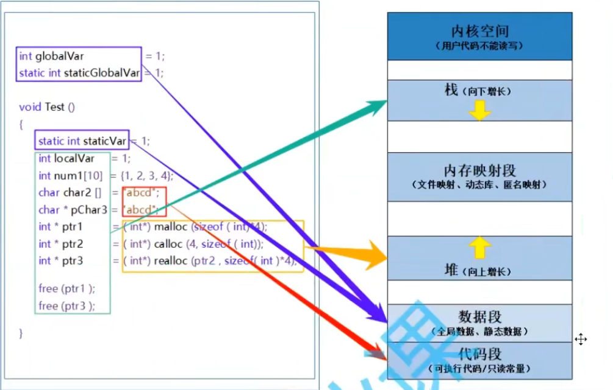
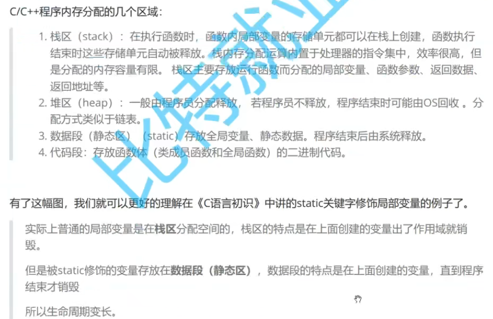

# 动态内存开辟
内存空间分为栈区，堆区和静态区。动态内存是在堆区实现的，方法时malloc,calloc,free,realloc

## malloc
- void* malloc(size_t size); size是B，若堆区空间充足，返回首地址，不充足则返回NULL
- 会初始化随机值
- 注意返回的是void*，一般要强制转换
- 注意要检查是否开辟成功
- 记得要用free，但是别free动态内存空间的内部，只能free首地址
- 注意内存泄漏问题：忘记free了
```
#include<stdlib.h>


int arr[10];
//申请动态空间
int *arr1 = (int *)malloc(10*sizeof(int));//并初始化随机值
if(arr==NULL)
{
    cout<<perror("main error:");
}
//回收空间
free(arr1);//回收空间，但是arr1还是指向首地址（之后的空间以及释放了）；只能释放动态分配空间
arr1=NULL;//为了防止变成野指针
```

## calloc
- void* calloc(size_t num,size_t size);num个size字节的内存空间
- 会初始化0
- 其余跟malloc一样

## realloc，调整的分配后的空间大小
- void* realloc(void* ptr,size_t size);ptr，要调整的内存空间，size新的大小（B）
- 若空间不够增加，他会返回一个新的地址，并free掉原来的空间；但是如果一直找不到空间，它会返回NULL。所以使用时，将返回值赋给一个tmp，若不为NULL才赋给p。

>一段错误的代码，请指出错误并改正
```
char* GetMemory(void)
{
    char p[] = "hello world";
    return p;
}

void test()
{
    char* str =NULL;
    str = GetMemory();
    cout<<str;
}

int main()
{
    test();
    return 0;
}
```
>一段错误的代码，请指出错误并改正
```
void GetMemory(char*p)
{
    p = (char*)malloc(100);
}

void test()
{
    char *str = NULL;
    GetMemory(str);
    strcpy(str,"hello world");
    cout<<str;
}

int main()
{
    test();
    system("pause");
    return 0;
}
```
>一段错误的代码?，请指出错误并改正
```
//局部变量
int *f1(void){
    int x= 10;
    return (&x);
}

//野指针
int *f2(void){
    int *ptr;
    *ptr = 10;
    return ptr;
}

```
>C/C++的内存分配区域




# 柔性数组，可变大小的数组

```
struct S
{
    int n;
    int arr[];//这个就是柔性数组
};
```
1. 柔性数组成员前面必须有一个非柔性数组成员，即他必须是最后一个成员
2. sizeof（结构）是不包含柔性数组的大小的
3. 包含柔性数组成员的结构对象创建时要用struct S \*ps =(struct \*)malloc(sizeof(struct S)+10*sizeof(int));后面加的就是柔性数组（你想多大就在这设）
4. 创建完后，可以用realloc继续调整